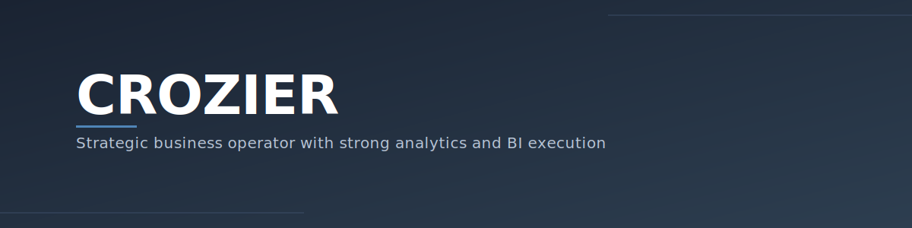

  

Take the thing apart

Study until it makes sense

Build it up again

**I enjoy:**
- Turning vague questions into clear decisions
- Bilding metrics people actually trust
- Finding the edge cases where systems break

**Currently**
- Strategy & ops work at a dental services scale-up
- Finishing my mba at IESE (spring 2026)
- Building an AI-assisted job search system 

**Analytics & BI Toolkit**  

**Let's Connect**  

